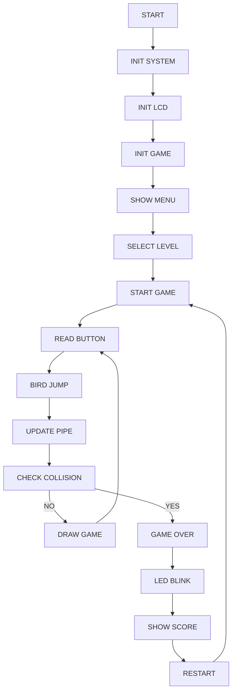

# FLAPPY BIRD GAME 

## Giới thiệu

Đây là project xây dựng game Flappy Bird sử dụng KIT STM32F401RE kết hợp KIT LUMI mở rộng

Game được phát triển bằng ngôn ngữ C trên STM32 SPL SDK.

---

## Chức năng chính

- Điều khiển chim bằng nút nhấn
- Có 2 level:
  - Easy
  - Hard
- Tốc độ ống thay đổi theo level
- Phát âm thanh khi nhấn nút điều khiển
- LED nhấp nháy khi game over
- Hiển thị điểm số trên LCD

---

## Phần cứng sử dụng

| Thiết bị | Mô tả |
|---|---|
| STM32F401RE | Vi điều khiển chính |
| LCD ST7735 | Hiển thị game |
| Push Button | Điều khiển |
| LED | Báo hiệu game over |
| Buzzer | Phát âm thanh |

---


## Cấu trúc project

```text
Inc/
├── main.h
├── bird.h
├── pipe.h
├── game.h
└── buzzer.h

Src/
├── main.c
├── bird.c
├── pipe.c
├── game.c
└── buzzer.c
```

---

## Thuật toán hoạt động

### Luồng chính

1. Khởi tạo GPIO
2. Khởi tạo LCD
3. Khởi tạo game
4. Hiển thị menu
5. Chọn level
6. Bắt đầu game
7. Điều khiển chim
8. Kiểm tra va chạm
9. Game over
10. Nhấp nháy LED

---

## Lưu đồ thuật toán


---

## Điều khiển

| Nút | Chức năng |
|---|---|
| BTN1 | Jump / Start |
| BTN2 | Change Level |

---

## Các level

### Easy
- Pipe speed = 2

### Hard
- Pipe speed = 4

---

## Hướng dẫn build project

### Bước 1
Clone project và thư viện SDK

```bash
git clone https://github.com/HD-Nam/ThuVien_SDK_1.0.3_NUCLEO-F401RE.git
git clone https://github.com/quangms26/flappy-bird-stm32
```

### Bước 2
Mở bằng STM32CubeIDE.

### Bước 3
Cấu hình đường dẫn Include trong Project Properties > C/C++ Build > Settings > MCU GCC Compiler > Include paths:
```bash
ThuVien_SDK_1.0.3_NUCLEO-F401RE/shared/Drivers/CMSIS/Include
ThuVien_SDK_1.0.3_NUCLEO-F401RE/shared/Drivers/STM32F401RE_StdPeriph_Driver/inc
ThuVien_SDK_1.0.3_NUCLEO-F401RE/shared/Middle/button
ThuVien_SDK_1.0.3_NUCLEO-F401RE/shared/Middle/buzzer
ThuVien_SDK_1.0.3_NUCLEO-F401RE/shared/Middle/led
ThuVien_SDK_1.0.3_NUCLEO-F401RE/shared/Middle/sensor
ThuVien_SDK_1.0.3_NUCLEO-F401RE/shared/Middle/serial
ThuVien_SDK_1.0.3_NUCLEO-F401RE/shared/Middle/ucglib
ThuVien_SDK_1.0.3_NUCLEO-F401RE/shared/Middle/flash
ThuVien_SDK_1.0.3_NUCLEO-F401RE/shared/Middle/rtos
ThuVien_SDK_1.0.3_NUCLEO-F401RE/shared/Utilities
```
### Bước 4
Cấu hình đường dẫn thư viện trong MCU GCC Linker > Library search paths:

ThuVien_SDK_1.0.3_NUCLEO-F401RE/lib_stm

### Bước 5
Build bằng Ctrl+B

### Bước 6 
Nạp chương trình qua Run > Debug

---


## Kết quả đạt được

- Game hoạt động ổn định trên STM32
- LCD hiển thị mượt
- Điều khiển thời gian thực


---

## Tác giả
Nguyễn Văn Quang + Đỗ Thành Nam
